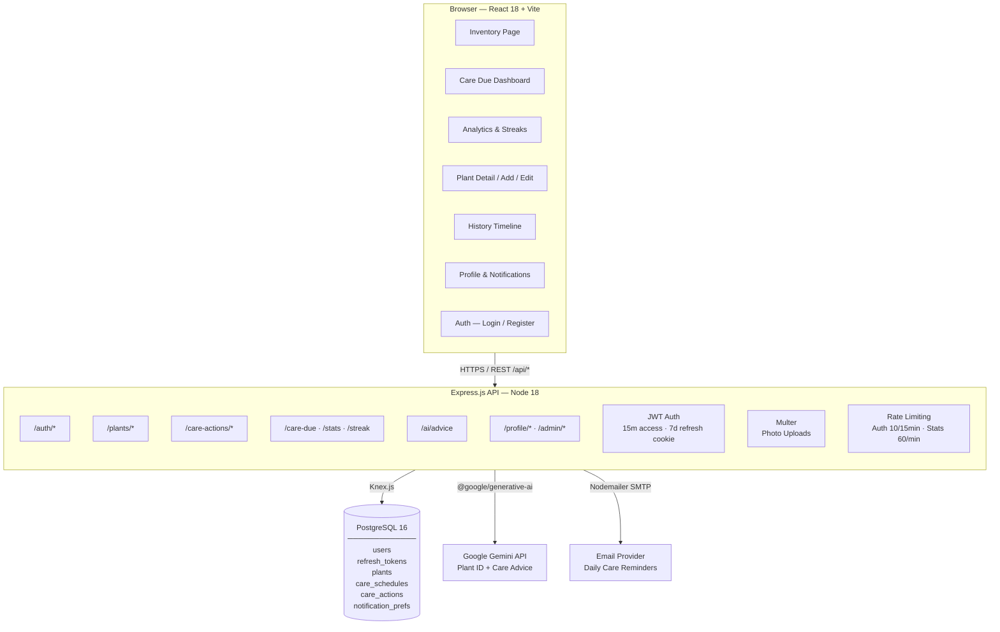
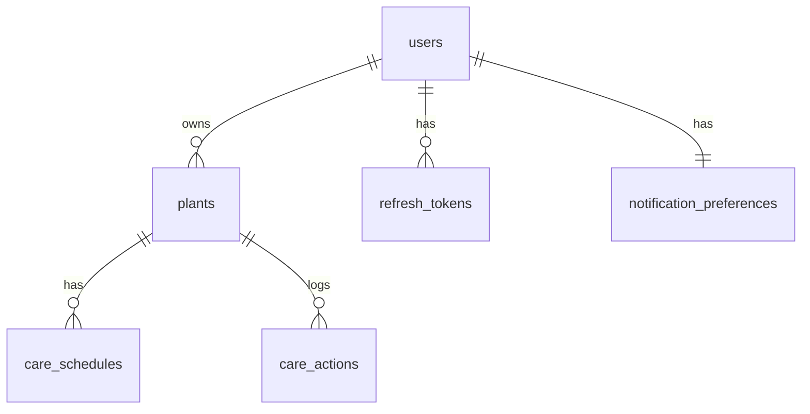

# Plant Guardians

A web app for casual plant owners who struggle to keep their plants alive. Track your plant collection, set watering and care schedules, get AI-powered care advice, and stay on top of every overdue plant — all in one place.

---

## Architecture



### Data Relationships



---

## Features

| Feature | Description |
|---------|-------------|
| **Plant Inventory** | Add, edit, and delete plants with photos, type, and notes |
| **Care Schedules** | Set watering, fertilizing, and repotting frequencies per plant |
| **Care Due Dashboard** | Centralized view of overdue, due-today, and upcoming tasks |
| **Batch Mark Done** | Select multiple plants and log care actions in one tap |
| **AI Plant Advice** | Upload a photo or enter a plant type → Gemini identifies it and gives personalized care tips |
| **Care History** | Paginated timeline of all past care actions |
| **Analytics & Streaks** | Care action stats by type, per-plant breakdowns, consecutive-day care streaks |
| **Email Reminders** | Optional daily digest of plants needing care (opt-in, configurable hour) |
| **Persistent Login** | HttpOnly refresh token cookies — stay logged in across sessions |
| **Dark Mode** | Full dark/light theme support |

---

## Tech Stack

| Layer | Technology |
|-------|-----------|
| Frontend | React 18, Vite, React Router, Phosphor Icons |
| Backend | Node.js 18, Express.js |
| Database | PostgreSQL 16, Knex.js (migrations + query builder) |
| Auth | JWT (15-min access tokens) + HttpOnly refresh token cookies (7-day) |
| AI | Google Gemini API (`@google/generative-ai`) |
| Email | Nodemailer (SMTP) |
| File Uploads | Multer (local filesystem) |
| Testing | Vitest + React Testing Library (frontend), Jest + Supertest (backend) |
| Deployment | Render.com (PostgreSQL + Node web service + static site) |
| Local Dev DB | Docker Compose (PostgreSQL 16) |

---

## Local Development

### Prerequisites

- Node.js 18+
- Docker (for the local database)

### Setup

```bash
# 1. Install dependencies
cd backend && npm install && cd ..
cd frontend && npm install && cd ..

# 2. Configure environment
cp backend/.env.example backend/.env
# Edit backend/.env — at minimum set JWT_SECRET and DATABASE_URL

# 3. Start PostgreSQL
docker compose -f infra/docker-compose.yml up -d
# Starts plant_guardians_db on :5432 and plant_guardians_db_test on :5433

# 4. Run migrations
cd backend && npm run migrate && cd ..

# 5. Start backend (terminal 1)
cd backend && npm run dev
# Runs on http://localhost:3000

# 6. Start frontend (terminal 2)
cd frontend && npm run dev
# Runs on http://localhost:5173
# Vite proxies /api/* to localhost:3000 — no CORS config needed
```

Open http://localhost:5173, register an account, and start adding plants.

### Common Commands

**Backend:**

| Command | Description |
|---------|-------------|
| `npm run dev` | Start dev server (Nodemon, auto-reload) |
| `npm test` | Run 188 tests (Jest + Supertest) |
| `npm run migrate` | Apply pending migrations |
| `npm run migrate:rollback` | Undo last migration batch |

**Frontend:**

| Command | Description |
|---------|-------------|
| `npm run dev` | Start Vite dev server |
| `npm run build` | Build for production |
| `npm test` | Run 262 tests (Vitest + RTL) |
| `npm run lint` | Lint with ESLint |

---

## Environment Variables

### Backend (`backend/.env`)

| Variable | Required | Default | Description |
|----------|----------|---------|-------------|
| `DATABASE_URL` | Yes | — | PostgreSQL connection string |
| `JWT_SECRET` | Yes | — | 64-hex secret for signing access tokens |
| `FRONTEND_URL` | Yes (prod) | `http://localhost:5173` | CORS allowlist (comma-separated) |
| `NODE_ENV` | — | `development` | Runtime mode |
| `PORT` | — | `3000` | Express server port |
| `JWT_EXPIRES_IN` | — | `15m` | Access token TTL |
| `REFRESH_TOKEN_EXPIRES_DAYS` | — | `7` | Refresh token TTL (days) |
| `GEMINI_API_KEY` | — | — | Google Gemini API key (AI advice degrades gracefully if unset) |
| `UPLOAD_DIR` | — | `./uploads` | Local directory for plant photos |
| `MAX_UPLOAD_SIZE_MB` | — | `5` | Photo upload size cap |
| `EMAIL_HOST` | — | — | SMTP host (email reminders disabled if unset) |
| `EMAIL_PORT` | — | `587` | SMTP port |
| `EMAIL_USER` | — | — | SMTP username |
| `EMAIL_PASS` | — | — | SMTP password |
| `EMAIL_FROM` | — | `Plant Guardians <noreply@...>` | Sender display name |
| `UNSUBSCRIBE_SECRET` | — | — | HMAC secret for unsubscribe tokens |
| `APP_BASE_URL` | — | `http://localhost:5173` | Frontend URL (used in email CTAs) |

### Frontend (`frontend/.env`)

| Variable | Required | Description |
|----------|----------|-------------|
| `VITE_API_BASE_URL` | Production only | Backend API base URL (dev/staging use Vite proxy) |

---

## API Overview

Base URL: `/api/v1/`

**Response format:**
```json
// Success
{ "data": { ... }, "pagination": { "total": 42, "page": 1, "limit": 50 } }

// Error
{ "error": { "message": "Not found", "code": "PLANT_NOT_FOUND" } }
```

**Authentication:** `Authorization: Bearer <access_token>` header + HttpOnly `refresh_token` cookie

| Group | Endpoints |
|-------|-----------|
| Auth | `POST /auth/register`, `/auth/login`, `/auth/refresh`, `/auth/logout`, `DELETE /auth/account` |
| Plants | `GET/POST /plants`, `GET/PUT/DELETE /plants/:id`, `POST /plants/:id/photo` |
| Care Actions | `POST /plants/:id/care-actions`, `DELETE /plants/:id/care-actions/:id`, `GET /care-actions` |
| Dashboard | `GET /care-due`, `GET /care-actions/stats`, `GET /care-actions/streak` |
| Batch | `POST /care-actions/batch` (atomic multi-plant, returns 207 Multi-Status) |
| AI | `POST /ai/advice` (Gemini plant ID + care tips) |
| Profile | `GET /profile`, `GET/PATCH /profile/notification-preferences` |
| Admin | `POST /admin/reminders/trigger` (manual email dispatch) |
| Unsubscribe | `GET /unsubscribe?token=<hmac>` |

---

## Deployment (Render.com)

The project ships with a `render.yaml` blueprint for one-click deployment.

1. Push to GitHub
2. Create a new Blueprint in Render, point it at the repo
3. Set required env vars: `JWT_SECRET`, `GEMINI_API_KEY`, `FRONTEND_URL`, `DATABASE_URL`
4. Deploy — Render provisions PostgreSQL, builds the frontend static site, and starts the backend web service

See `RENDER_DEPLOY.md` for detailed step-by-step instructions.

> **Free tier note:** The backend spins down after 15 min idle (expect ~30–60 sec cold starts). Plant photos are stored on the filesystem and will be lost on redeploy. PostgreSQL expires after 90 days on the free plan.

---

## Project Structure

```
plant_guardians/
├── backend/            Express API, Knex migrations, tests (Jest)
├── frontend/           React + Vite SPA, tests (Vitest)
├── infra/              Docker Compose, render.yaml
├── shared/             Shared types (planned)
├── .agents/            AI agent system prompts
├── .workflow/          Sprint plans, specs, API contracts, logs
└── orchestrator/       Sprint automation scripts
```

---

## How This Was Built

Plant Guardians was built by eight specialized Claude Code agents collaborating in automated sprints — a Manager, Design Agent, Backend Engineer, Frontend Engineer, QA Engineer, Deploy Engineer, and Monitor Agent. Each sprint adds features end-to-end (design → API → UI → tests → deploy → verify) with no human code contribution.

To run a new sprint:

```bash
./orchestrator/orchestrate.sh
```

See `CLAUDE.md` for the full framework documentation.
